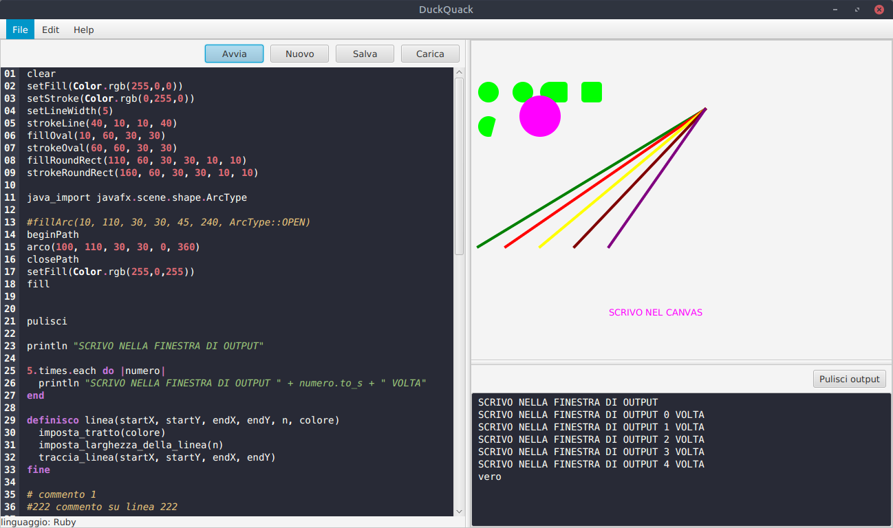
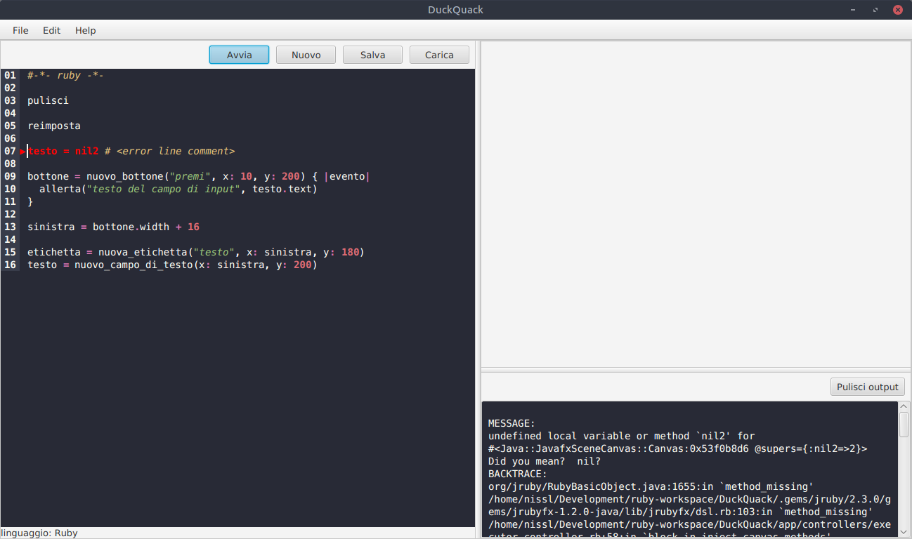

DuckQuack
===

DuckQuack è un semplice ambiente per sperimentare in [Ruby](https://www.ruby-lang.org/it/).
È scritto in [JRuby](http://jruby.org/) per consentire una maggior portabilità grazie alla piattaforma Java su cui viene eseguito.
L'interfaccia usa le [JavaFx](http://docs.oracle.com/javase/8/javafx/api/toc.htm) come libreria di appoggio.

L'ambiente è diviso in tre parti: *il codice*, un *canvas* aperto su cui si può immediatamente disegnare, un'area di *output* testuale.



### Codice

Il codice supportato è **Ruby** che viene eseguito e valutato travite il pulsante *avvia*. In caso di errori:



la linea viene evidenziata e il *backtrace* è presente nell'area di output.

Il sistema prevede una certa personalizzazione che va dalla colorazione della sintassi attraverso due file:

+ ```./code/ruby/syntax-specs.yml```: *una serie di regole per il controllo della sintassi*
+ ```./code/ruby/syntax-specs.css```: *una serie di stili per la colorazione della sintassi*

Nella stessa cartella un file *code.yml* permette di specificare una serie di righe predefinite da eseguire insieme al codice. Utile per eventuali *require* o *import* da usare in maniera predefinita.

Oltre alla personalizzazione del linguaggio e dell'editor tramite i file di cui sopra, nella cartella ```./locale/it``` c'è il file (```locale.yml```) per le traduzione di alcune parte dell'interfaccia, dei metodi da eseguire ed un *mapping* di sostituzioni in linea prima della esecuzione. In linea di principio si dovrebbe poter personalizzare il codice per le varie eveniente senza troppa difficoltà.

Il sistema è espandibile im alcuni modi.

+ tramite il meccanismo di *bundler* usando il gemfile e reinizializzando il database delle *gemme* esistenti ed indispensabili. Nella cartella ```bin``` è presente un wrapper per *bundler* per questa funzionalità. 
+ All'avvio vengono caricate le librerie java (jarfile) che sono presenti e vengono richiesti i file Ruby che ci sono. 
+ Nella stessa maniera nella cartella ```app/helpers``` anche se questa dovrebbe essere ritenuta privata dell'applicazione. 
+ Inoltre anche nella cartella ```locale/it``` possono essere presenti file Ruby.

Per il *canvas* sono presenti tutte le primitive grafiche per disegnare e sono quindi immediatamente utilizzabili (fare riferimenti alla documentazione JavaFx della classe [GraphicsContext](http://docs.oracle.com/javase/8/javafx/api/javafx/scene/canvas/GraphicsContext.html).

Sono presenti alcune primitive per la creazione di interfacce grafiche all'interno del canvas:

+ ```reset``` (pulisce il camvas dagli oggetti di interfaccia)
+ ```alert(caption, message)``` e ```alert_and_wait(caption, message)``` (per finestre di allerta)
+ ```control_add(control)``` (aggiunge un controllo al contenitore dopo avero costruito)
+ ```button_create(text, opts, &block)``` (crea un controllo alle coordinate fornite)
+ ```label_create(text, opts = {}, &action)``` 
+ ```text_field_create(opts = {}, &action)```
+ ... (fare riferimento al file ```app/helpers/running_code_helpers.rb```)

Ogni nome di funzione aggiunta nei vari modi è localizzabile nel suo nome con i meccanismi accennati prima.

Ovviamnte tutto questo salvo bachi.
